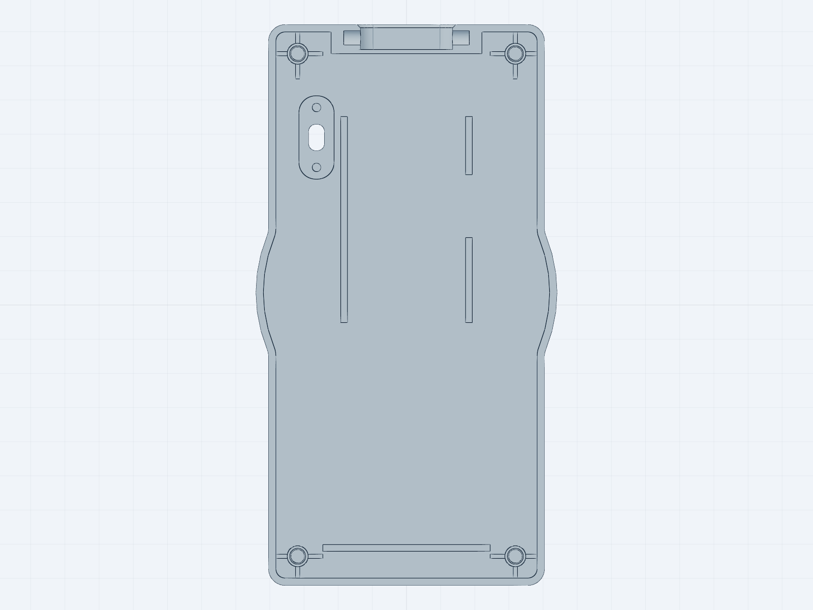
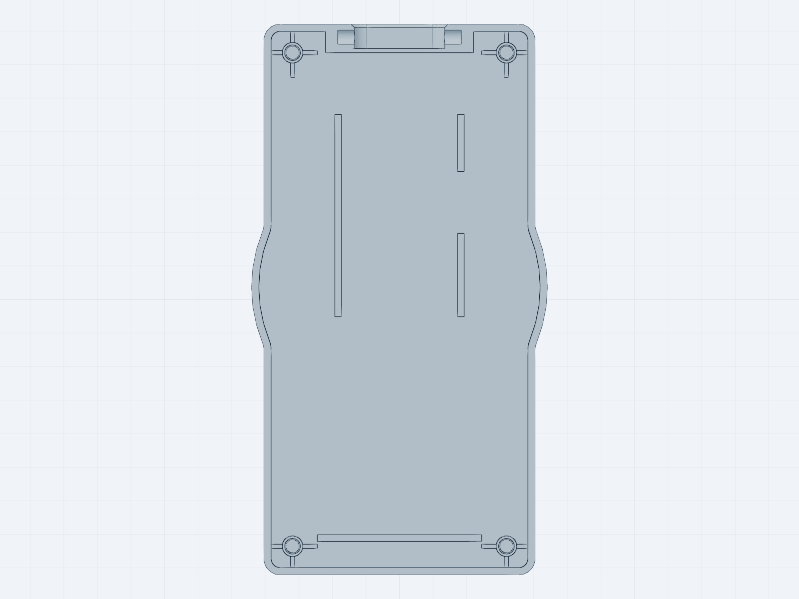

# Speaker Badge — enclosure (print-ready STL)

3D-printable enclosure for the **threejs.paris speaker badge**: an ESP32-S3
conference badge with a 2.1" round 360×360 TFT, three buttons, a LiPo battery
and a lanyard bar.

This repo holds only the **print-ready STL files for the Medium body**
(66 × 134 mm, the size the 40-badge run was built with). The parametric
build123d source that generates them lives in
[hervestudio/speaker-badges](https://github.com/hervestudio/speaker-badges),
and the firmware in
[hervestudio/firmware-badge](https://github.com/hervestudio/firmware-badge).

| | |
|---|---|
|  |  |
| `back_shell_medium_switch.stl` | `back_shell_medium.stl` |

## Choose your back shell

Print **one** of the two. They are identical except for the switch housing.

**`back_shell_medium_switch.stl` — recommended.** Adds a housing for a
physical power switch: a recess for the switch flange, a through slot for the
lever, a shallow finger dish around it on the outside, and two Ø2.0 mm pins
you melt over the flange holes with a soldering iron to retain it. Sized for a
**TRU TC-R13-603C-05 / SCI R13-603** slide switch (SPDT, 3 A, 19.5 × 8 mm
flange, 14.3 mm hole pitch, 5.8 mm body depth).

**`back_shell_medium.stl` — original.** The back as it was printed for the
event, no switch.

> **Why you want the switch.** The original badge had no way to physically cut
> the battery. The 5 V boost converter keeps drawing ~0.3 mA even with the
> firmware "off", which after the event drained the cells below their
> protection cutoff — most of them never recovered. Wire the switch in series
> on the battery **+** line, between the cell and the TP4056 `B+` pad: in the
> OFF position nothing draws current at all. Note that the badge then only
> charges with the switch ON.

## What to print

| File | Qty per badge | Notes |
|---|---|---|
| `front_shell_medium.stl` | 1 | Screen side |
| `back_shell_medium_switch.stl` **or** `back_shell_medium.stl` | 1 | See above |
| `button_cap_side.stl` | 2 | Chevron icon, both sides identical |
| `button_cap_center.stl` | 1 | Smiley icon |
| `screw_cap.stl` | 4 | Decorative caps over the screw heads |
| `small_parts_plate.stl` | — | All 7 caps above on a single plate, for one print |

## Print settings

Tested on a **Bambu Lab A1 in PLA**, 0.2 mm layers, 2 walls, 15 % infill,
**no supports and no brim**.

- **Shells**: print in their native orientation — **outer face down, cavity
  opening up**. In that pose the USB cutout, the lanyard slot and the button
  holes are all open notches at the top, so nothing needs support.
- **Caps**: they are already lying flat, **engraved face against the plate**.
  Printing them face-down is what makes the icons come out crisp.
- Useful tweaks from the production run: `elephant foot compensation 0`,
  `initial layer line width 0.45`, bottom surface pattern `monotonic line`.

**Two-colour caps** (coloured icon on a black cap) need no separate model: the
icon is engraved 0.4 mm deep, which is exactly 2 layers at 0.2 mm. Slice a cap
normally and insert a filament change at the start of layer 3 — colour for
layers 1-2, black from layer 3 up.

## After printing

- **Pierce the sacrificial membranes.** The screw-cap counterbores and the
  button counterbores are closed by a single 0.2 mm layer, so the ceiling above
  them prints over solid material instead of bridging over a hole. Push them
  out with the tip of an M2 screw or a craft knife before assembly.
- **Heat-set the 4 brass inserts** (M2, H4, Ø3.2) into the back shell's blind
  holes, pressed in from the seam side.
- **Closing screws**: 4 × **M2 × 12 mm** countersunk. 12 mm, not 10 — the front
  face is 8.75 mm thick, and an M2 × 10 barely bites into the insert.

The full pin-by-pin wiring and assembly guide is
[`tools/montage-badge.html`](https://github.com/hervestudio/firmware-badge/blob/main/tools/montage-badge.html)
in the firmware repo (open it in a browser).

## Electronics

Not in this repo. The bill of materials, the wiring and the firmware are in
[hervestudio/firmware-badge](https://github.com/hervestudio/firmware-badge) —
and you can try the badge in your browser, without any hardware, at
**https://hervestudio.github.io/firmware-badge/**.

## License

MIT — see [LICENSE](LICENSE).
